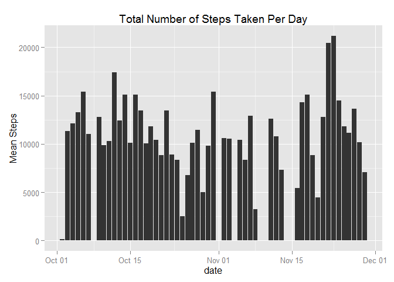
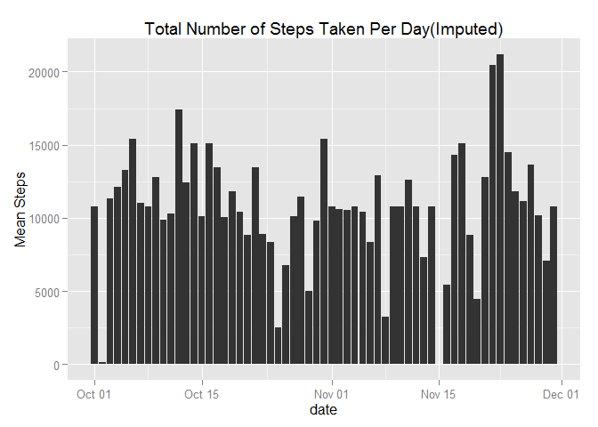
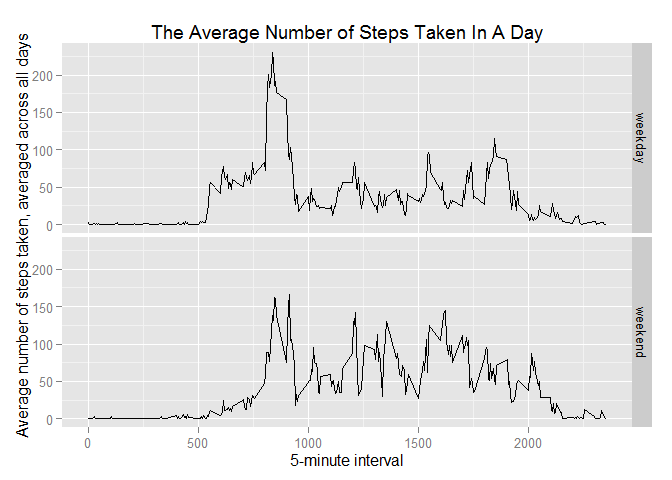

# Reproducible Research: Peer Assessment 1


## Loading and preprocessing the data

```r
install.packages("ggplot2", repos = 'http://cran.us.r-project.org')
```

```
## package 'ggplot2' successfully unpacked and MD5 sums checked
## 
## The downloaded binary packages are in
## 	C:\Users\David\AppData\Local\Temp\Rtmpo7NO1q\downloaded_packages
```

```r
library("ggplot2")
activityNa <- read.csv("activity.csv")
activityNa$date <- as.POSIXlt(as.character(activityNa$date), format="%Y-%m-%d")
activity <- activityNa[!is.na(activityNa$steps),]
```


## What is mean total number of steps taken per day?

```r
#Make a histogram of the total number of steps taken each day
g <- ggplot(activity, aes(x=date, y=steps)) + 
    stat_summary(fun.y = "sum", geom="bar") + 
    labs(title="Total Number of Steps Taken Per Day", y="Mean Steps")
print(g)
```

 

```r
#Calculate and report the mean and median total number of steps taken per day
stepPerDay <- summary(aggregate(steps ~ as.Date(date), activity ,FUN=sum)$steps)
```
The mean total steps taken per day is 1.077\times 10^{4} and the median 
is 1.076\times 10^{4}.


## What is the average daily activity pattern?

```r
#Make a time series plot (i.e. type = "l") of the 5-minute interval (x-axis) and
    #the average number of steps taken, averaged across all days (y-axis)
g <- ggplot(activity, aes(x=interval, y=steps)) + 
    stat_summary(fun.y = "mean", geom="line") + 
    labs(title="The Average Number of Steps Taken In A Day", 
         x="5-minute interval", 
         y="Average number of steps taken, averaged across all days")

#Which 5-minute interval, on average across all the days in the dataset, 
    #contains the maximum number of steps?
aggSumInt <- aggregate(steps ~ interval, activity ,FUN=sum)
maxInt <- aggSumInt[aggSumInt$steps == max(aggSumInt$steps), "interval"]
```
The 5-minute interval with the maximum number of steps averaged across all days 
is 835.


## Imputing missing values

```r
#Calculate and report the total number of missing values in the dataset 
    #(i.e. the total number of rows with NAs)
numNa <- sum(is.na(activityNa))


#Devise a strategy for filling in all of the missing values in the dataset. 
#The strategy does not need to be sophisticated. 
#For example, you could use the mean/median for that day, 
    #or the mean for that 5-minute interval, etc.

#This dataset imputed its missing values with the mean of the missing interval 
    #across all days.

#Create a new dataset that is equal to the original dataset but 
    #with the missing data filled in.

aggMeanInt <- aggregate(steps ~ interval, activity ,FUN=mean)

numDays <- max(as.Date(activityNa$date)) - min(as.Date(activityNa$date))
for(i in 1:numDays){                  
    activityNa[is.na(activityNa$steps),"steps"] <- aggMeanInt[
        aggMeanInt$interval == activityNa[is.na(activityNa$steps), "interval"],
        "steps"]
}

#Make a histogram of the total number of steps taken each day and Calculate and 
    #report the mean and median total number of steps taken per day. 
#Do these values differ from the estimates from the first part of the assignment?
#What is the impact of imputing missing data on the estimates of the total daily 
    #number of steps?
g <- ggplot(activityNa, aes(x=date, y=steps)) + 
    stat_summary(fun.y = "sum", geom="bar") + 
    labs(title="Total Number of Steps Taken Per Day(Imputed)", y="Mean Steps")
print(g)
```

 

```r
stepPerDayI <- summary(aggregate(steps ~ as.Date(date), activityNa ,FUN=sum)$steps)
```
The dataset 'activity.csv' has 2304 rows with missing values.

With imputed values, the mean total steps taken per day is 
1.077\times 10^{4} versus the original of 1.077\times 10^{4}.

The median is 1.077\times 10^{4} versus the original of 
1.076\times 10^{4}.

By inserting the mean value of steps per day in more locations in the dataset, 
the median was moved towards the mean.


## Are there differences in activity patterns between weekdays and weekends?

```r
#Use the dataset with the filled-in missing values for this part.
#Create a new factor variable in the dataset with two levels -- "weekday" and 
    #"weekend" indicating whether a given date is a weekday or weekend day.
activityNa$weekday <- as.factor(ifelse(activityNa$date$wday == 0 | 
                                           activityNa$date$wday == 6, "weekend", "weekday"))

#Make a panel plot containing a time series plot (i.e. type = "l") 
    #of the 5-minute interval (x-axis) and the average number of steps taken, 
    #averaged across all weekday days or weekend days (y-axis). 
#The plot should look something like the following, which was created using 
    #simulated data:
g <- ggplot(activityNa, aes(x=interval, y=steps)) + 
    stat_summary(fun.y = "mean", geom="line") + 
    labs(title="The Average Number of Steps Taken In A Day", 
         x="5-minute interval", 
         y="Average number of steps taken, averaged across all days")
g <- g +facet_grid(weekday ~ .)
print(g)    
```

 
